# Cost optimisation check list 

## Checklist 
|#|Guidance  |Cost Optimisation Impact  |Complexity to implement |
|-|---------|---------|---------|
|1|Purchase **Azure Reservation**, for VMs, Redis cache, Managed DBs, app Service, ...,  Purchase **Reserve Capacity**  Storage, Tier for Log Analytics, Sentinel, ...|HIGH|MEDIUM|
|2|Microsoft workloads : **AHUB** + Dev&Test subscriptions , SQL : Developer License/Managed Instances|HIGH|LOW|
|3|Rightsizing VMs / Upgrade instances to the latest generation, B-Series|MEDIUM|MEDIUM|
|4|Terminate zombie resources: Delete unused VMs, Delete unattached storage volumes, Release unattached Elastic IP addresses|MEDIUM|MEDIUM|
|5|Scheduling on/off times|HIGH|MEDIUM|
|6|Use Spot Instances|MEDIUM|LOW|
|7|Move infrequently-accessed data to lower cost tiers (cold storage)|LOW|MEDIUM|
|8|Standard SSD vs Premium SSD|MEDIUM|HIGH|
|9|PaaS services : Use PaaS services to decrease mgmt costs (Scale Up/Down, Stop/Start)|MEDIUM|HIGH|
|10|Modernize architecture : densify usage (ex AKS vs VMs) + auto scaling (VMSS, AKS, Serverless DB, …)|MEDIUM|HIGH|

## Azure Reservation 
### Why 
**Save Money** with Azure reservation.  
Learn how Azure Reservations help you save money by committing to one-year or three-years plans for virtual machines, Azure Blob storage or Azure Data Lake Storage Gen2, SQL Database compute capacity, Azure Cosmos DB throughput, and other Azure resources.  

The above lines are the exhibit of the official online documentation available [here](https://docs.microsoft.com/en-us/azure/cost-management-billing/reservations/)

### To know 
- List of azure workload covered by reservation is available [here](https://docs.microsoft.com/en-us/azure/cost-management-billing/reservations/save-compute-costs-reservations?toc=%2Fazure%2Fvirtual-machines%2Fwindows%2Ftoc.json#charges-covered-by-reservation). 
- All reservations, except Azure Databricks, are applied on an **hourly basis**.
- Azure reservation as a **scope**, scope definition [here](https://docs.microsoft.com/en-us/azure/cost-management-billing/reservations/prepare-buy-reservation#scope-reservations). 
- Reservation scope can be changed, details [here](https://docs.microsoft.com/en-us/azure/cost-management-billing/reservations/manage-reserved-vm-instance#change-the-reservation-scope).  
Example: previously assigned VM reservation to resource group can be changed to subscription for the reservation to be used across all the subscription. 
- Unused reserved capacity doesn't carry over from one hour to next, in other words unused reserved capacity is **lost**.
- Usage exceeding the reserved quantity is charged using more expensive pay-as-you-go rates.
- VM reservation is tied to a VM series.  
Reservation purchased for ES series VMs do not apply to E series VMs, and vice-versa.  
- VM reservation consumption is subject to ratio when size flexibility is enable, details [here](https://docs.microsoft.com/en-us/azure/virtual-machines/windows/reserved-vm-instance-size-flexibility).  
**1 CPU VM reservation type is consumed 2 times quicker on a 2 CPUs VM from the same series.** 
- Software costs not included with Azure Reserved VM Instances, details [here](https://docs.microsoft.com/en-us/azure/cost-management-billing/reservations/reserved-instance-windows-software-costs).

### How to identify what to purchase.
Determine what to purchase with:
- Azure advisor virtual machines only 
- Reservation purchase experience in the Azure portal
- Cost Management Power BI app
- APIs

Details can be found [here](https://docs.microsoft.com/en-us/azure/cost-management-billing/reservations/determine-reservation-purchase#reservation-purchase-recommendations).

#### VM
Azure advisor is the easiest way to identify **virtual machine** reserve instance to buy  
https://ms.portal.azure.com/#blade/Microsoft_Azure_Expert/AdvisorMenuBlade/Cost
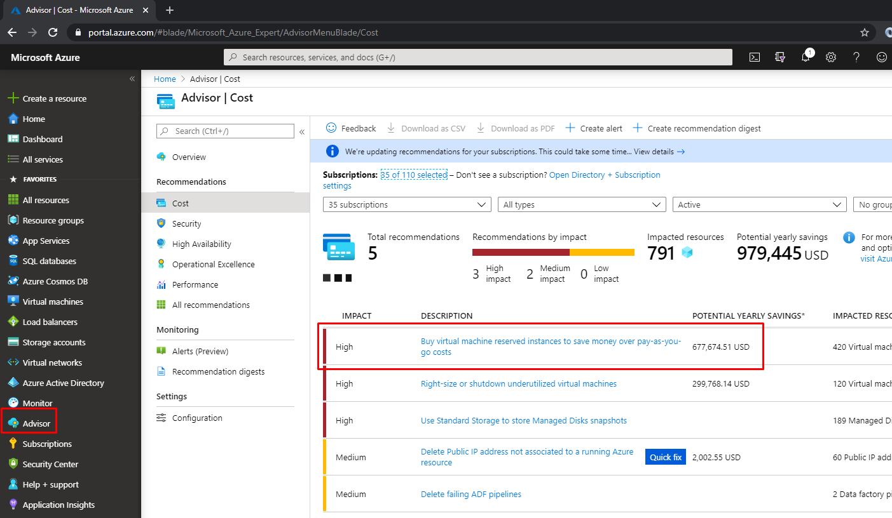

### Monitor usage
It is critical to monitor reservation usage to avoid under-utilization and over spent.
how to view azure reservation usage can be found [here](https://docs.microsoft.com/en-us/azure/cost-management-billing/reservations/view-reservations).

### Reconmmendations and best practices
- VM standardization should be maximized to simplify azure VM reservation adoption. 
- VM shared scope should used to maximise utilisation, details of scope [here](https://docs.microsoft.com/en-us/azure/cost-management-billing/reservations/prepare-buy-reservation#scope-reservations)
- When azure reservation are bought centrally, businesses lines should be consulted before buying to get long term visibility and potential decomissionning, replatforming, migration to new application architecture, ...

### Pain points and difficulties
- **Charge back** to internal businesses lines.  
In case the azure reservation are bought centrally and assigned to a shared scope subscription, charge back process could be very complex.   
VM Reservation Instance (RI) are assigned randomly to any suitable VM and can flip from one VM to another multiple times during a day.  
Distribution of discount can be then very complex if you want all the lines of businesses to benefit equal discount.  
EG: if you have 3 identicals VMs in 3 subscriptions, and 2 Reservations VMs, on day 1 it could be assigned to VM1 and VM3 and day 2 to VM1 and VM2, and day 3 to again VM1 and VM2 
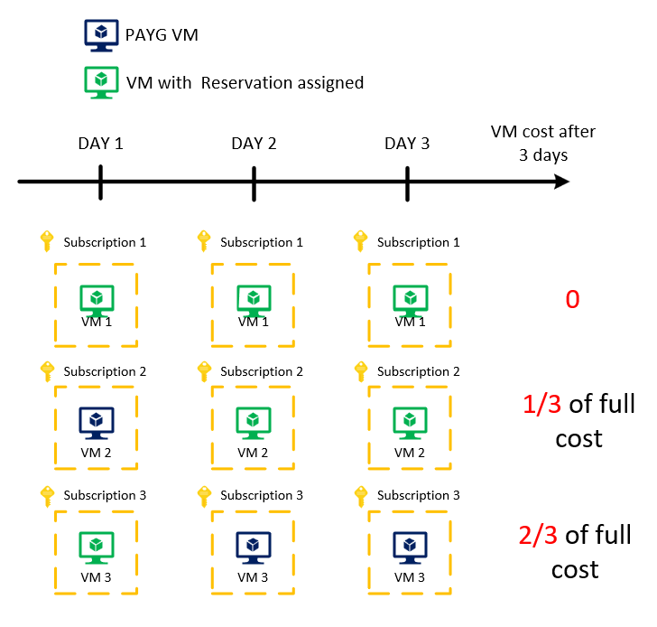
    > [!NOTE]
    > - How to view amortized charge back in azure portal is explained [here](https://docs.microsoft.com/en-us/azure/cost-management-billing/reservations/charge-back-usage).  
    > - How to get it from the EA portal as a csv file [here](https://docs.microsoft.com/en-us/azure/cost-management-billing/reservations/understand-reserved-instance-usage-ea).  
    > - How to get it for an individual subscription as a csv file [here](https://docs.microsoft.com/en-us/azure/cost-management-billing/reservations/understand-reserved-instance-usage).
- **50K$ refund rolling limit**: you can refund reservation instance VM to a limit of 50K$ over a 1 year rolling period.  
- **refund and repurchase** new reservation: the new purchase total should equal or be greater than the returned amount
    > [!NOTE]
    > all the exchange and refund policies information can be found [here](https://docs.microsoft.com/en-us/azure/cost-management-billing/reservations/exchange-and-refund-azure-reservations#cancel-exchange-and-refund-policies). 

## Microsoft workloads : AHUB + Dev&Test subscriptions , SQL : Developer License/Managed Instances

### Why ? 
The Azure Hybrid Benefit (AHB) is a pricing benefit for customers who have licenses with Software Assurance, which helps maximize the value of existing on-premises Windows Server and/or SQL Server license investments when migrating to Azure.

Eligible customers can save up to 40%* on Azure Virtual Machines (infrastructure as a service, or IaaS), and save up to 55% on Azure SQL Database (platform as a service, or PaaS) and SQL Server on Azure Virtual Machines (IaaS) with Azure Hybrid Benefit, which increases to up to 80% when combined with Azure Reserved Instances.
$$SEB: 
- Four cores in the cloud for every one core on-premises for Enterprise edition customers in the General Purpose or Hyperscale service tiers.
- Support extension for SQL Server 2008 and 2008 R2 workloads to Azure virtual machines is free for 3 years after EOL [https://www.microsoft.com/en-us/cloud-platform/windows-server-2008](https://www.microsoft.com/en-us/cloud-platform/windows-server-2008).

Several considerations before using AHB,
- Customer own eligible SQL Server and/or Windows Server licenses with active Software Assurance or the equivalent qualifying subscription licenses
- $$SEB: Only azure vCore based PaaS SQL and manage instance version is eligible to AHB, DTU cost based model is not eligible.  
DTU to vCore conversion is possible, migration scenario [here](https://docs.microsoft.com/en-us/azure/azure-sql/database/migrate-dtu-to-vcore)  
As a rule of thumb, every 100 DTUs in the standard tier require at least 1 vCore, and every 125 DTUs in the premium tier require at least 1 vCore. For more information, see https://docs.microsoft.com/en-us/azure/azure-sql/database/  
purchasing-models

#### vcore-based-purchasing-model. 
Find cost model [here](https://azure.microsoft.com/en-us/pricing/hybrid-benefit/) 

#### FAQ
Azure hybrid benefit FAQ [here](https://azure.microsoft.com/en-us/pricing/hybrid-benefit/faq/)

The Enterprise Dev/Test Offer is a way to run their development and testing workloads on Azure, with numerous advantages :  
Low rates on specific Azure services (Windows Server billing at the Linux rate, Website on Windows billing at the linux rate, HdInsights on Windows node billing at the linux rate, Logic App Enterprise connection is billing at 50%,etc.)

#### Dev and Test 
Several considerations before using Dev/Test offers,
- The Enterprise Dev/Test offer is restricted to dev/test usage only, and only by active Visual Studio subscribers
- The Enterprise Dev/Test offer is not covered by Service Level Agreements
- An Enterprise offer can be converted to Dev/Test offer with support ticket but not vice versa
- The Entreprise Dev/Test offer has low quotas by default - see in attachment. This quota could not be increased by the support.

$$SEB the excel file need to be dropped on a SA and link provided. 

#### SQL Developer and Express Licence
The SQL Developer and Express Licence are free edition for SQL Server with a fully featured version of SQL Server software—including all of the features and capabilities of Enterprise Edition.

Several considerations before using the free edition,
- The SQL Developer and Express License is restricted for development, test and demonstration purposes only

### How to
#### Azure Hybrid Benefit
- How to declare it,
	- For Windows Server [here](https://docs.microsoft.com/en-us/azure/virtual-machines/windows/hybrid-use-benefit-licensing#create-a-vm-with-azure-hybrid-benefit-for-windows-server) 
	- For Azure SQL Database [here](https://github.com/MicrosoftDocs/azure-docs/blob/master/articles/sql-database/sql-database-azure-hybrid-benefit.md)
- How to follow it,
    - In the portal with "OS Licenscing benefit" column  
    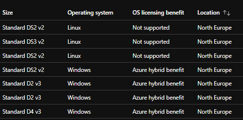

#### Enterprise Dev/Test Offer
- How to declare it,
    - The enterprise administrator of the EA Enrollment enable the Dev Test offer in the EA portal
    - Account Owner only see the EA Dev/Test offer option in the subcriptions lists  
    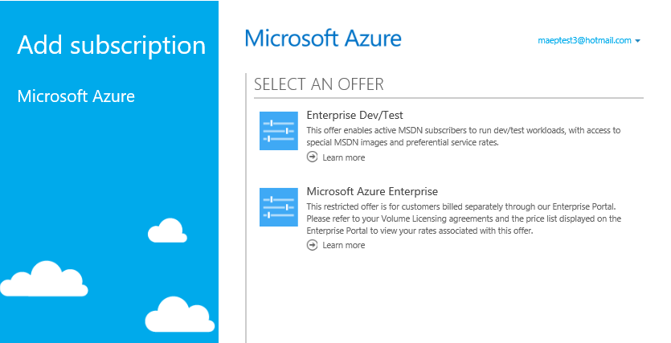	
- How to follow it,
    - You can retrieve the offer ID through Azure portal [here](https://azure.microsoft.com/en-us/support/legal/offer-details/)
	- It's not possible to get a subscriptions offer ID through API today [here](https://feedback.azure.com/forums/170030-signup-and-billing/suggestions/36518317-get-offer-id-programmatically-through-powershell)

#### SQL developer and Express License
$$ SEB to be completed

### Pitfalls
The Azure Hybrid Benefit can be widely used by our customers as long as the considerations are respected. We advice you to "double-check" with the PSS and Licensing Team if the licensing term of the customer is eligible for Hybrid Use.

The Enterprise Dev/Test can be use in moderation or full knowledge because of certain limitations of usages (only for Visual Studio subscribers) and quotas (more lower than EA offer).

The SQL Developer and Express licence --> Voir avec Sébastien

### Measure the impact
Unfortunately, we don't have "out of the box" solution to measure the cost impact for Dev/Test compared to EA Offer. We have to manually evaluate the benefits based on resources which will be deployed on Dev/Test subscriptions.

For AHB and SQL Developer and Express licenses, we can use the metric "Virtual Machines Licenses" in Cost Management to evaluate the actual costs for SQL Server (Azure SQL Databases is not included) and Windows Server licenses. This metric could be used as Non-BYOL footprint that can be optimized.

## Rightsizing VMs / Upgrade instances to the latest generation

### Why 
Although certain application scenarios can result in low utilization by design, you can often save money by managing the size and number of your virtual machines.  
Advisor advanced evaluation models considers:
- virtual machines for shut-down when P95th of max value of CPU utilization is less than 3% and network utilization is less than 2% over a 7 day period. 
- Virtual machines are considered for right size when it is possible to fit the current load in a smaller SKU (within the same SKU family) or a smaller number of instance such that the current load doesn’t go over 80% utilization when non-user facing workloads and not above 40% when user-facing workload. Here, the type of workload is determined by analyzing the CPU utilization characteristics of the workload.

The recommended actions are shut-down or resize, specific to resource being recommended for. Advisor shows you the estimated cost savings for either recommended actions - resize or shut-down. Also, for resize recommended action, Advisor provides current and target SKU information.

If you want to be more aggressive at identifying underutilized virtual machines, you can adjust the CPU utilization rule on a per subscription basis. 
$$SEB Internal MS IT recommendation is 18% for CPU utilization. 

### How to
First you should have a look at Azure Advisor in Cost Pilar see https://docs.microsoft.com/en-us/azure/advisor/advisor-cost-recommendations#optimize-virtual-machine-spend-by-resizing-or-shutting-down-underutilized-instances

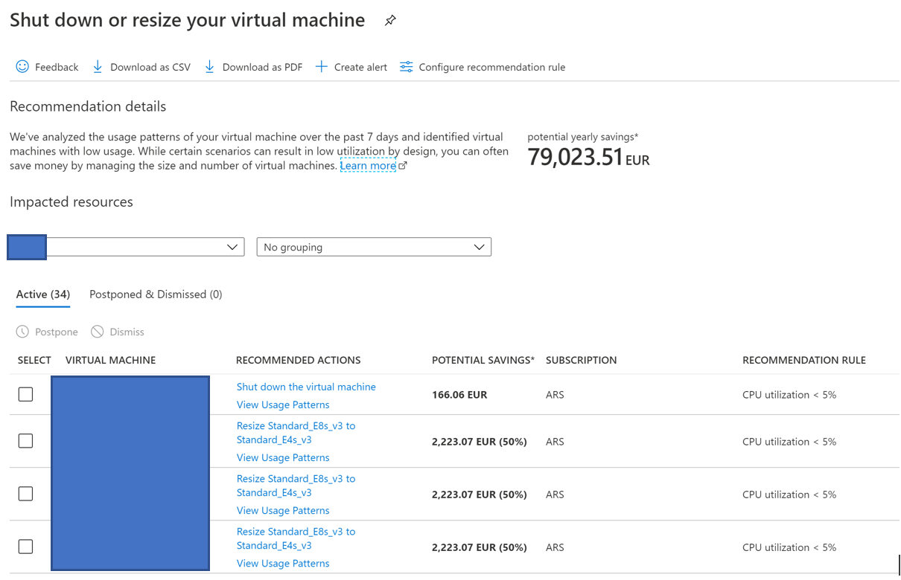
Our advice here is to focus on biggest resources to have more impact during cost optimization.

If you want to perform a more detailed analysis, per application for instance, you should consider using Azure Monitor Insight for Virtual Machines.
Azure Monitor for VMs monitors your Azure virtual machines (VM) and virtual machine scale sets at scale.  
It analyzes the performance and health of your Windows and Linux VMs, and monitors their processes and dependencies on other resources and external processes.  
It includes support for monitoring performance and application dependencies for VMs that are hosted on-premises or in another cloud provider. The following key features deliver in-depth insight:
- Pre-defined trending performance charts: Display core performance metrics from the guest VM operating system.
- Dependency map: Displays the interconnected components with the VM from various resource groups and subscriptions.

See https://docs.microsoft.com/en-us/azure/azure-monitor/insights/vminsights-overview

As a prerequisite you should activate Guest-Level monitoring, Azure provides a set of standard host-level metrics but Guest OS metrics are not available by default. You can use guest-level monitoring to collect metrics of your guest virtual machines. 
- For new virtual machines
    - Log in to the Azure portal.
    - In the left pane, select Virtual machines.
    - Click Add to create a virtual machine.
    - On the Management tab, enable the OS guest diagnostics option.
    - Add the required information to create the virtual machine and click Review + create.
    - The virtual machine is created with the virtual machine agent installed in the guest OS.  
    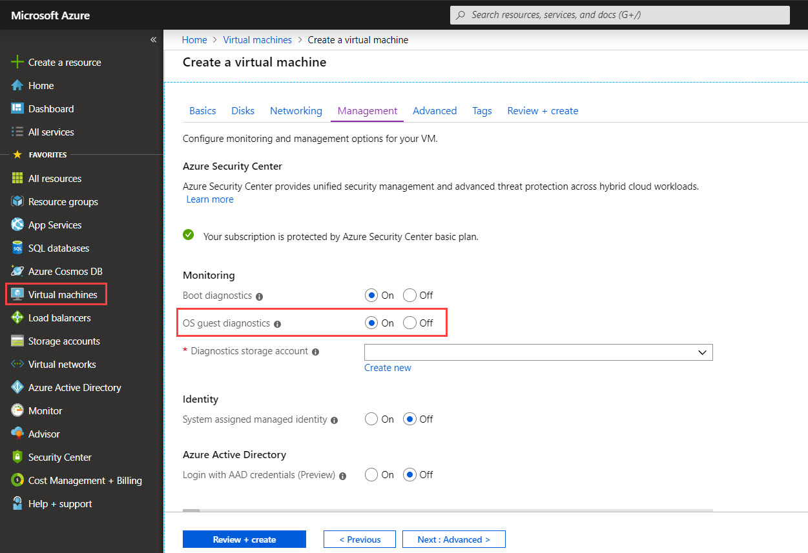
- For existing virtual machines
    - Log in to the Azure portal.
    - In the left pane, select Virtual machines.
    - A list of your virtual machines is displayed. 
    - Select the virtual machine for which you want to enable guest-level monitoring.
    - In the left pane of virtual machine, in the Monitoring category, click Diagnostic settings.
    - On the Diagnostics settings page, click Enable guest-level monitoring.
    - The Azure diagnostics agent is installed on the virtual machine and the metrics are displayed in the Overview tab.  
    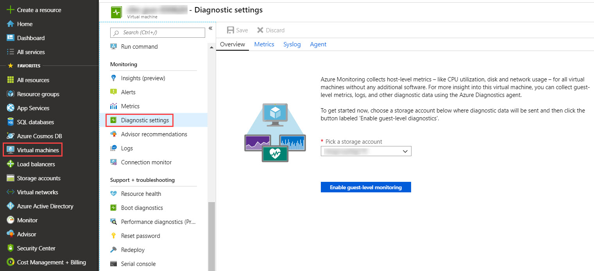

### Pitfalls
Don't try to over optimize and focus on big chunks.
Warning if infrastructure managed by MSP, there might be additional costs for resizing / upgrade.
Azure advisor 7 days window analysis is sometime to short to capture monthly peak of activities. 
Business, application owners/administrators should be consulted to get their point of view

### Measure the impact
Cost per resource per month (Azure Cost Management / Azure Graph / Azure Advisor release recommandation)

## Terminate zombie resources: Delete unused VMs, Delete unattached storage volumes, Release unattached Elastic IP addresses

### Why
- Zombies are everywhere, consuming resources in every customer's environment.  
- Zombie VM's are virtual machines that were provisioned and for one reason unintentionally not used. This can be due to stalled or abandoned projects or even incomplete decommissioning procedures. Despite being unused, Zombie VM's continue to eat valuable Compute, Memory, Storage, and even Network resources costing organizations money and exposing unnecessary security risks.

### How to 
- Use Azure Advisor to track unused Public IP addresses or Unattached storage - https://docs.microsoft.com/en-us/azure/advisor/advisor-cost-recommendations $$CDU : +VM and Storage  
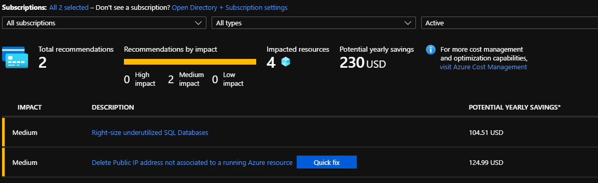

### Pitfalls 
- Identify zombie VMs. These are VMs that can be killed and have their current workloads moved to other VMs. Just look at the three common dimensions, CPU, memory, and I/O (network mainly), to identify these underutilized VMs.
- Use templates to industrialize the provision and unprovision resources $$CDU : revoir la phrase

### Measure the impact
Figure out the right KPIs (Key Performance Indicators). A single KPI won’t give you the full picture of your capacity. Your team should track at least one KPI per capacity dimension. Here you go some examples:
- Cost KPIs: cost per user or cost per operation (direct and indirect), or cost per micro service,
- Performance KPIs: APIs latency (90, 95 and 100 percentiles of users),
- Resources KPIs: cost per CPU, effective CPU cost (utilization included), cost per memory GB.

## Scheduling on/off times
### Why
This is one of the promises of the Cloud to reduce the costs and optimize the resources. One way is to turn-off resources when not needed. This approach is widely implemented by our customer with a high impact on cost reduction.  
$$CDU: on parle d'un client en particulier ?

For IAAS, this particularly applies for virtual machines which can be deallocate, then, you will only pay for storage.

For PAAS, most of the servcices can not be stopped except for few of them, $$CDU : on est sur de ça ?
- Data : Synapse Data Analytics, Azure SQL Serverless Db
- Compute : Functions, Batch, Container Instance (ACI), Cognitive Services

### How to
You can use the recommendations on Azure Advisor - see https://docs.microsoft.com/en-us/azure/advisor/advisor-cost-recommendations#optimize-virtual-machine-spend-by-resizing-or-shutting-down-underutilized-instances.  
Quite frequently, our customers are working with the product owners to identify which resources in which environments can be stopped. 

The start & stop is one of the first automation process to be implemented : https://docs.microsoft.com/en-us/azure/automation/automation-solution-vm-management.  
Even if we provide integrated mechanism in VM configuration or templates in Azure Automation, this process remains quite complex to be fully industrialized and operational. For example, we don't stop only one VM but an end-to-end application with multiple VMs which have an order to be stopped or a timeframe…  
If VMs are stop over weekends, at least once a month it could be started again to perform patching activities. 

You can use the existing template in Azure Automation as starting point : https://docs.microsoft.com/en-us/azure/automation/automation-solution-vm-management-config#schedule and modify it in order to respond to your needs.

### Pitfalls
- Production is "usually" not eligible
- Non-production can be automatically start & stop during off-hours
- Dev and Staging can be automatically in a specif hour and start manually once the users can start by himself $$CDU : à compléter

### Measure the impact
- Identify the best candidates - Applications with high consumption in non-production. 
- Use Cost Management to follow the implementation and evaluate the cost reduction $$CDU : per application (=RG) ?  
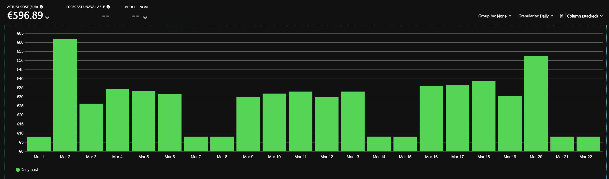

## Use Spot Instances 

### Why 

With Azure Spot Virtual Machines (Spot VMs), you’ll be able to access unused Azure compute capacity at deep discounts—up to 90 percent compared to pay-as-you-go prices. You pay up to the maximum price that you optionally agree to in advance. Spot VMs are ideal for workloads that can be interrupted, providing scalability while reducing costs. 

Savings:  
60 to 90 % Very dependant on the eviction policy choosen See https://azure.microsoft.com/en-us/pricing/spot/  
$$CDU : je ne comprends pas car le prix payé correspond surtout au max price lors de l'acquisition

Can come on top of dev/test pricing discount

Prices are fixed on a monthly basis (for now, may change) and billed as VM with the special spot prices. 
https://azure.microsoft.com/en-us/pricing/details/virtual-machines/linux/  
Ex :  
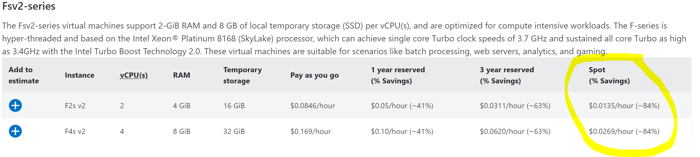

### Caution/pitfalls :
- Workloads have to support interruption and even retry if needed. ($$CDU : retry mandatory non ?)
- B Series and "Special Offer" VM are excluded from Spot
- NO SLA !
- IN GA very recently (May 12th)
- Spot VM have a specific quota this quota have to be raised independantly from the VM Core quota
(Limits : https://docs.microsoft.com/en-us/azure/azure-resource-manager/management/azure-subscription-service-limits#virtual-machines-limits)
- To be warned about eviction, the VM need to poll http://169.254.169.254/metadata/scheduledevents?api-version=2019-01-01
- No capacity monitoring API exposed publicly to customer (to check the available capacity a a specfic region). But internally Jarvis is your friend ! : https://jarvis-west.dc.ad.msft.net/dashboard/AzureComputeManager/Fabricator/LowPriorityVMReport
- Not yet available for services like databricks (but would make sense), feature requested, under consideration for Q3 CY2020
- In preview for AKS
- No integration in Azure advisor yet (no warning before eviction or capacity disponibility, PG working on it)
- Spot in the new name for low priority (sometimes old name is unsed in docs)
- Only for modern offers (EA, PAYG, some CSPs) no other offering supported
- Only "Deallocate" supported yet, no deletion of the VM (Disks are still charged)

### Recommanded workload
- High-performance computing scenarios, batch processing jobs, or visual rendering applications.
- Dev/test environments, including continuous integration and continuous delivery workloads.
- Large-scale stateless applications.

You can use Spot VMs for various fault-tolerant and flexible applications. Examples include web servers, API backends, continuous integration/continuous development, and Hadoop data processing.  
Workloads that constantly save data to persistent storage can work effectively with Spot VMs.  
You can also take advantage of Spot VMs to run and scale applications such as stateless web services, image rendering, big data analytics, and massively parallel computations. Spot VMs are typically used to supplement On-Demand Instances, where appropriate, and are not meant to handle 100% of your workload. However, you can use all Spot VMs for any stateless, non-production application, such as development and test servers, where occasional downtime is acceptable. They are not a good choice for sensitive workloads or databases.
AI Model on AKS --> $$CDU ??

### How to 
Upon creation you have the possibility to specify your VM (or scale set) as a spot VM (or scale set) and get all the parameters regarding the eviction policy:

Portal : https://docs.microsoft.com/en-us/azure/virtual-machines/windows/spot-portal  
PS : https://docs.microsoft.com/en-us/azure/virtual-machines/windows/spot-powershell  
ARM : https://docs.microsoft.com/en-us/azure/virtual-machines/linux/spot-template?toc=/azure/virtual-machines/windows/toc.json  

### Reference and documentation :
SPOT VM GA announcement : https://azure.microsoft.com/is-is/blog/announcing-the-general-availability-of-azure-spot-virtual-machines/  
Spot VM main doc : https://docs.microsoft.com/en-us/azure/virtual-machines/windows/spot-vms  
Spot and scale set : https://docs.microsoft.com/en-us/azure/virtual-machine-scale-sets/use-spot  
Spot VM and AKS : Preview : https://docs.microsoft.com/en-us/azure/aks/spot-node-pool  

Best Practices $$CDU à regrouper avec pitfalls/cautions  
Here are some effective ways to best utilize Azure Spot VMs:
- For long running operations, try to create checkpoints so that you can restart your workload from a previously known checkpoint to handle evictions and save time.
- In scale-out scenarios, to save costs, you can have two VMSS, where one has regular VMs and the other has Spot VMs. You can put both in the same load balancer to opportunistically scale out.
- Listen to eviction notifications in the VM to get notified when your VM is about to be evicted.
- If you are willing to pay up to pay-as-you-go prices then use Eviction type to Capacity Eviction only, in the API provide -1 as max price as Azure never charges you more than the Spot VM price. $$CDU Ré-expliquer les eviction types 
- Capacity only: evict virtual machine when Azure needs the capacity for pay as you go workloads. Your max price is set to the pay as you go rate.
- Price or capacity: choose a max price and Azure will evict your virtual machine when the cost of the instance is greater than your max price or when Azure needs the capacity for pay as you go workloads.
- To handle evictions, build a retry logic to redeploy VMs. If you do not require a specific VM series and size, then try to deploy a different size that matches your workload needs.
- While deploying VMSS, select max spread in portal management tab or FD==1 in the API to find capacity in a zone or region.

### Measure the impact
From the monthly Bill Compare Spot VM SKU with corresponding regular VM  
Integrated in the calculator  
$$CDU : KPI with price per vcore / vCPU

### Questions
Internal : Use internal stackoverflow, tagname #lowpri, monitored by PG  $$SEB what is the URL for the internal Stockoverflow ?
External : for customers https://docs.microsoft.com/en-us/answers/topics/azure-spot.html  

## Move infrequently-accessed data to lower cost tiers (cold storage)
### Why
Azure storage offers different access tiers, which allow you to store blob object data in the most cost-effective manner. The available access tiers include:
- Hot - Optimized for storing data that is accessed frequently.
- Cool - Optimized for storing data that is infrequently accessed and stored for at least 30 days.
- Archive - Optimized for storing data that is rarely accessed and stored for at least 180 days with flexible latency requirements (on the order of hours).

https://docs.microsoft.com/en-us/azure/storage/blobs/storage-blob-storage-tiers?tabs=azure-portal

### How to
You can use tiering policies : https://docs.microsoft.com/en-us/azure/storage/blobs/storage-lifecycle-management-concepts?tabs=azure-portal

### Pitfalls 
Minimum retention for Cool (30d) and Archive (180d) tiers   
Transactions cost for Archive tiers are high, avoid archive for write intensive small files  

### Measure the impact
Storage cost (per GB)  
Disk Storage / Object Storage

## Standard SSD vs Premium SSD
### Why 
Azure Managed Disks are the new and recommended disk storage offering for use with Azure Virtual machines for persistent storage of data.  
You can use multiple managed disks with each virtual machine.  
Microsoft Azure offers four types of Managed disks : 
- Ultra Disk, 
- Premium SSD Managed Disks, 
- Standard SSD Managed Disks, 
- Standard HDD Managed Disks.  
We will focus on SSD disks which offer high performance to support I/O intensive workloads with significantly high throughput and low latency.  

This managed disks often choose the Premium SSK Disks ignoring the other choices which can also offer high performance with a lower price. $$CDU : revoir la phrase
- Standard SSD Managed Disk is two times cheaper than Premium SSD Managed Disk. For example, an 1 TB SSD Disk in West Europe
    - Standard SSD : E30 = 64,77 €/month
    - Premium SSD : P30 = 125,38 € /month

### How to
- Monitor  the VM Performance using Azure Monitor. The utilization charts are "Logical Disk IOPS" and "Logical Disk MB/s"the logical Disk IOPS and MB/s - https://docs.microsoft.com/en-us/azure/azure-monitor/insights/vminsights-performance
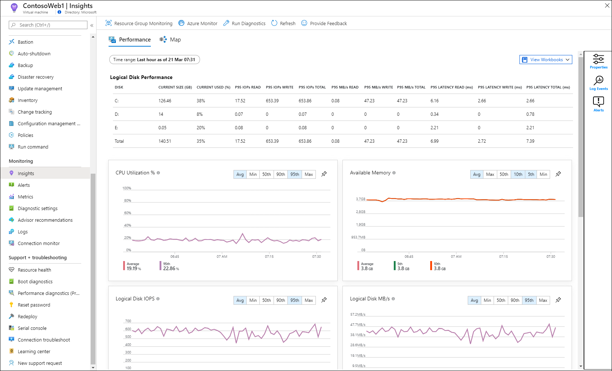  
- You can convert Azure managed disks storage from Premium to Standard and Vice & Versa - This functionality is not supported for unmanaged disks : https://docs.microsoft.com/en-us/azure/virtual-machines/linux/convert-disk-storage
    - The conversion requires a restart of the VM
    - The conversion itself is instantaneous, but this is separate from the back-end tasks of moving data between media types, which is done as a background operation
    - The customer will not notice an immediate shift in performance across the whole dataset immediately after the conversion (which is understandable), but requested I/Os are prioritized during the migration. The total time taken to complete the background operation will, of course, depend on the amount of data on the disk(s) that are being converted.
    - Unfortunately, the customer is not noticed when the background copy operation is finished

### Pitfalls?
- As general recommendation, under 500 IOPS we recommend to use Standard SSD disks

### Measure the impact
Disk Storage cost (per GB)  
Dissociate Managed Disks for Virtual Machines and Storage for Backup or Snapshots

## PaaS services : Use PaaS services to decrease mgmt costs

### Why 
Platform as a service (PaaS) is a complete development and deployment environment in the cloud, with resources that enable you to deliver everything from simple cloud-based apps to sophisticated, cloud-enabled enterprise applications. You purchase the resources you need from a cloud service provider on a pay-as-you-go basis and access them over a secure Internet connection. 

Like IaaS, PaaS includes infrastructure—servers, storage, and networking—but also middleware, development tools, business intelligence (BI) services, database management systems, and more. PaaS is designed to support the complete web application lifecycle: building, testing, deploying, managing, and updating.

PaaS allows you to avoid the expense and complexity of buying and managing software licenses, the underlying application infrastructure and middleware, container orchestrators such as Kubernetes, or the development tools and other resources. You manage the applications and services you develop, and the cloud service provider typically manages everything else.

See https://azure.microsoft.com/en-us/overview/what-is-paas/

### How to 
This actually depends on the kind of application you need to assess: Is it 1- a new application or 2- application migration ?  
This actually depends on the kind of application you need to assess: Is it 1- a new application or 2- application migration ?  
1. Please refer to Modernize architecture to leverage Cloud Native architectures (#10)
2. You have to refactor all or part of the application

You can refer to Cloud Adoption Framework #Refactor step to get more information on the migration methodology https://docs.microsoft.com/en-us/azure/cloud-adoption-framework/digital-estate/5-rs-of-rationalization#refactor  

But let's focus on the low hanging fruits:  
- Managed DBs: 
    - SQL: SQL Server, MySQL, PostGreSQL, MariaDB --> Use Azure Database Migration Service https://azure.microsoft.com/en-us/services/database-migration/ for migration
    - NOSQL: MongoDB, Cassandra: Leverage CosmosDB compatible APIs 
- Blob Storage: Use it for static content (HTML, CSS, JS, IMG, …) or static website hosting (react, …) to get a cost effective and scalable platform.
- Containers: Migrate to AKS https://docs.microsoft.com/fr-fr/azure/aks/aks-migration On top of all containers benefits (scalability, portability… ), cost efficiency is an important feature. Indeed it allows to densify nodes usage, on average a VM is using about 20-30% of available performance while container orchestrators can go up to 70-80%. 

You also have PaaS services related optimizations, for instance:
- Storage: Use appropriate Replication / Redundancy level (from LRS to RA-GRS)
- Backup retention: Define optimal backup retention period
- Mutualization: App Service Plans for several applications)
- Bandwidth: leverage CDN to decrease output bandwidth

### Pitfalls
PaaS services are often more expensive than IaaS services simply because Microsoft is taking care of management tasks like patch management, backup, scaling, … So in a TCO approach customer should compare Paas service cost vs IaaS service + Management costs

Pay attention to PaaS services Licence tiering. Sometimes if you need to get full features it's gonna be very expensive, one of the best (or worst) example is API Management.
 
### Measure the impact
As mentioned earlier Azure Consumption is not relevant to follow cost optimisation effiency when migrating from IaaS to PaaS.
You should build a new KPI based on application cost including management cost.

A lot of MSPs are offering different management costs based on Cloud services types either IaaS or PaaS.

## Modernize architecture : Micro Services / Containers / Serverless
### Why
What are cloud-native applications?  
Cloud native applications are built from the ground up—optimized for cloud scale and performance. They’re based on microservices architectures, use managed services, and take advantage of continuous delivery to achieve reliability and faster time to market.
See https://azure.microsoft.com/en-us/overview/cloudnative/

Cloud Adoption Framework also covering this topic with #Rebuild step see https://docs.microsoft.com/en-us/azure/cloud-adoption-framework/digital-estate/5-rs-of-rationalization#rebuild

### How to
The goal of this document is not to detail all the options that customers might have to modernize applications with Cloud Native approach.
But you can refer to these documentations to learn more about modern architectures: serverless https://azure.microsoft.com/en-us/solutions/serverless/, containers https://azure.microsoft.com/en-us/overview/containers/ and microservices https://docs.microsoft.com/en-us/azure/architecture/microservices/

### Pitfalls
Need to develop applications with Cloud Native Architecture patterns like Retry, Circuit Breaker or CQRS… see https://docs.microsoft.com/en-us/azure/architecture/patterns/ 

Some benefits might be hard to evaluate from a cost perspective, like agility or scalability but they are very valuable from a business perspective.

### Measure the impact
Build advanced KPIs like cost per user to highlight features like scalability indeed cost per application is not enough for an optimized application that can adapt performance and sizing live.
