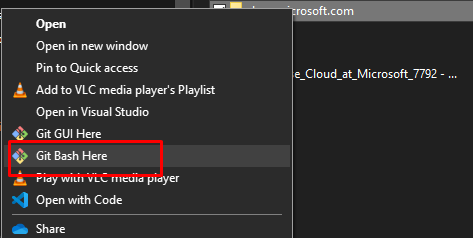
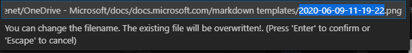

# How to contribute to the doc

## Prerequisites
all is documented [here](https://docs.microsoft.com/en-us/contribute/get-started-setup-tools) 
- Install [Git](https://git-scm.com/)
- Install [Visual Studio code](https://code.visualstudio.com/) 
- Install [docs Authoring Pack](https://marketplace.visualstudio.com/items?itemName=docsmsft.docs-authoring-pack)  
how to use the plugin is describe [here](https://marketplace.visualstudio.com/items?itemName=docsmsft.docs-markdown) 
- Install[ Markdown Past](https://marketplace.visualstudio.com/items?itemName=telesoho.vscode-markdown-paste-image) to directly past image from clipboard to md file

## Clone the repository
all is described [here](https://docs.microsoft.com/en-us/contribute/get-started-setup-local#choose-a-local-folder)  
- Create a folder on your disk, right click and select Git Bash here   

- run the following  
```bash
git clone https://github.com/sepenet/cost-management-billing.git
```
- Configure the remote upstream  
Change directory to cost-management-billing
```bash
git remote add upstream https://github.com/sepenet/cost-management-billing.git
git fetch upstream
```

## update with you change
whenever you have done your update do the following. 
```bash
git add --all
git commit -m "Short Description of Changes Made"
git push --set-upstream origin <branchname>
```

## Markdown syntax quick tips
few tips
- **New line**: add 2 spaces at the end of the line if you need to change line  
Example: first line 
this is shown on the *same line* even written on 2 lines in the md file because there is no or only 1 space at the end of the previous line 
this is shown on 2 lines  
this is the 2nd line. 
- **bullets** yes we can have multiples level of bullets
    - this the 2nd level
        - then the 3rd
            - on so on
1. **Numbering**  
2. 
4. even if "4." is written in the md 3. is shown :)  
    1. sub numbering works and translated to a., b. ...
    2. test 
    5. even if "5." is written in the md c. is shown :)
        1. 3rd level
        2. ...
- **Smart Past** images from the clipboard, just use CTRL+ALT+V  



### docs.microsoft.com markdown syntax
Reference to the markdown implemented at docs.microsoft.com is described here : https://docs.microsoft.com/en-us/contribute/markdown-reference  
example 
> [!NOTE]
> Information the user should notice even if skimming.

> [!TIP]
> Optional information to help a user be more successful.

...

